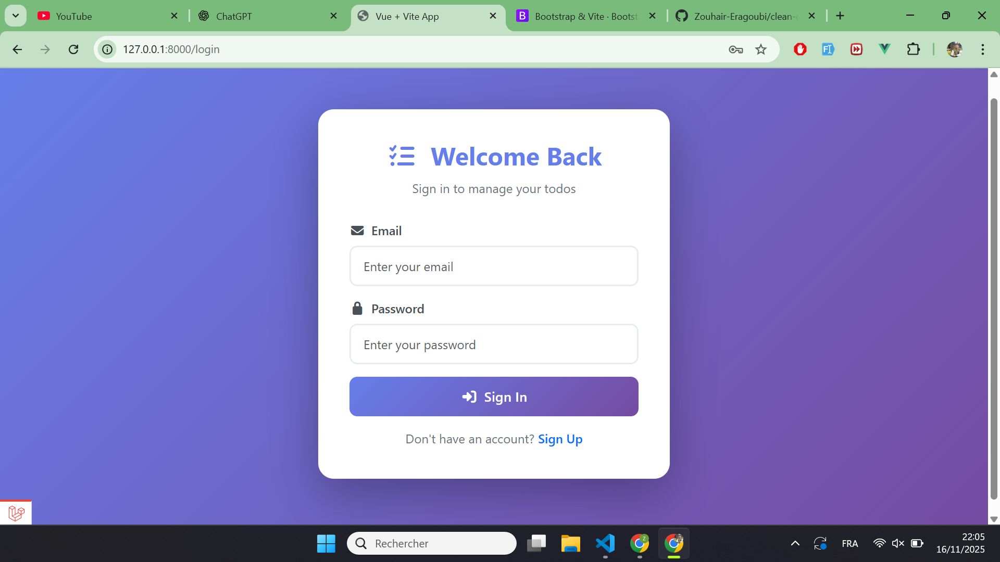
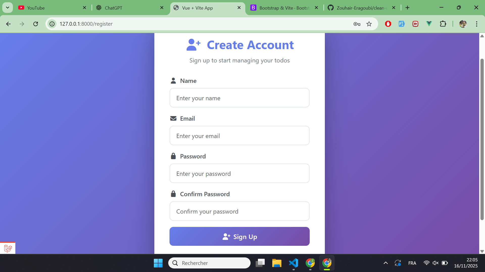
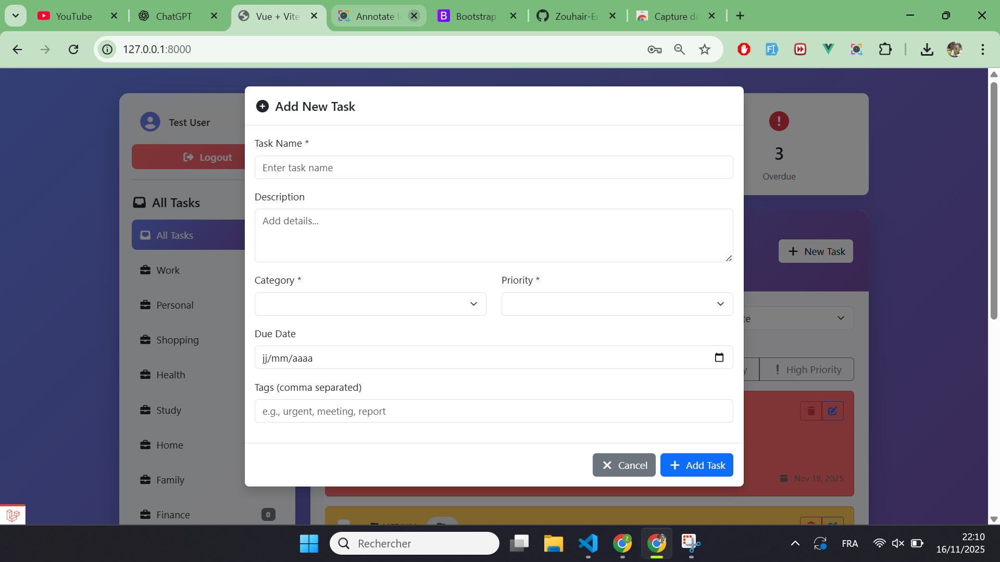

# Todo Application - Laravel API + Vue.js

A full-stack Todo application built with Laravel API backend and Vue.js frontend with Pinia state management.

## Screenshots

### Main Application


### Authentication
<table>
  <tr>
    <td width="50%">
      <b>Login</b><br>
      
    </td>
    <td width="50%">
      <b>Register</b><br>
      
    </td>
  </tr>
</table>

### Todo Management


## Features

- User authentication (Register, Login, Logout)
- Create, read, update, and delete todos
- Organize todos by categories
- Filter todos by:
  - Category
  - Completion status
  - Priority (High, Medium, Low)
  - Search query
- Sort todos by:
  - Date created
  - Priority
  - Title
- Toggle todo completion status
- User-specific todos and categories

## Tech Stack

### Backend
- Laravel 11.x
- SQLite Database
- Laravel Sanctum for API authentication
- RESTful API architecture

### Frontend
- Vue.js 3
- Pinia for state management
- Vue Router for navigation
- Vite for build tooling
- Modern ES6+ JavaScript

## Prerequisites

- PHP >= 8.2
- Composer
- Node.js >= 18.x
- npm or yarn

## Installation

### 1. Clone the repository

```bash
git clone <repository-url>
cd api_app
```

### 2. Install PHP dependencies

```bash
composer install
```

### 3. Install JavaScript dependencies

```bash
npm install
```

### 4. Environment setup

Copy the example environment file:

```bash
cp .env.example .env
```

Generate application key:

```bash
php artisan key:generate
```

### 5. Database setup

Create the SQLite database:

```bash
touch database/database.sqlite
```

Run migrations:

```bash
php artisan migrate
```

(Optional) Seed the database with sample data:

```bash
php artisan db:seed
```

## Configuration

### Vite Proxy Configuration

The application uses Vite's proxy feature to handle API requests during development. This is configured in `vite.config.js`:

```javascript
server: {
    proxy: {
        '/api': {
            target: 'http://localhost:8000',
            changeOrigin: true,
            secure: false,
        },
    },
}
```

This means:
- Frontend API calls use relative paths (e.g., `/api/todos`)
- Vite automatically proxies them to `http://localhost:8000/api/todos`
- No CORS issues during development
- No need for environment variables for API URL

### Path Aliases

The following path aliases are configured in `vite.config.js`:

- `@` → `resources/js`
- `@components` → `resources/js/components`
- `@views` → `resources/js/views`
- `@assets` → `resources/js/assets`
- `@stores` → `resources/js/stores`

## Running the Application

### 1. Start the Laravel development server

```bash
php artisan serve
```

The API will be available at `http://localhost:8000`

### 2. Start the Vite development server

In a new terminal:

```bash
npm run dev
```

The frontend will be available at the URL shown in the terminal (typically `http://localhost:5173`)

### 3. Access the application

Open your browser and navigate to the Vite dev server URL.

## API Endpoints

### Authentication

- `POST /api/register` - Register a new user
- `POST /api/login` - Login user
- `POST /api/logout` - Logout user
- `GET /api/user` - Get authenticated user

### Todos

- `GET /api/todos` - Get all todos for authenticated user
- `POST /api/todos/create` - Create a new todo
- `PUT /api/todos/update/{id}` - Update a todo
- `DELETE /api/todos/delete/{id}` - Delete a todo
- `PATCH /api/todos/toggle-completion/{id}` - Toggle todo completion status

### Categories

- `GET /api/categories` - Get all categories for authenticated user

## Project Structure

```
api_app/
├── app/
│   ├── Http/
│   │   ├── Controllers/
│   │   │   └── Api/
│   │   │       ├── CategoriesController.php
│   │   │       └── TodosController.php
│   │   └── Resources/
│   │       ├── CategoryResource.php
│   │       └── TodoResource.php
│   └── Models/
│       ├── Category.php
│       ├── Todo.php
│       └── User.php
├── database/
│   ├── migrations/
│   └── seeders/
│       ├── CategorySeeder.php
│       ├── TodoSeeder.php
│       └── UserSeeder.php
├── resources/
│   ├── css/
│   │   └── app.css
│   ├── js/
│   │   ├── components/
│   │   ├── views/
│   │   ├── stores/
│   │   │   ├── AuthStore.js
│   │   │   └── TodosStore.js
│   │   ├── router/
│   │   ├── assets/
│   │   ├── App.vue
│   │   └── app.js
│   └── views/
│       └── welcome.blade.php
├── routes/
│   ├── api.php
│   └── web.php
├── vite.config.js
├── package.json
└── composer.json
```

## Development Notes

### State Management

The application uses Pinia for state management with two main stores:

- **AuthStore** (`resources/js/stores/AuthStore.js`)
  - Handles user authentication
  - Manages user session and tokens
  - Stores user data

- **TodosStore** (`resources/js/stores/TodosStore.js`)
  - Manages todos and categories
  - Handles filtering, sorting, and searching
  - Manages CRUD operations for todos

### Authentication

- Uses Laravel Sanctum for API token authentication
- Tokens are stored in localStorage
- Protected routes require authentication
- Token is sent with each API request via Authorization header

### Database

- Uses SQLite for simplicity
- Database file located at `database/database.sqlite`
- Migrations create necessary tables with proper relationships
- Seeders provide sample data for testing

## Building for Production

### 1. Build frontend assets

```bash
npm run build
```

### 2. Optimize Laravel

```bash
php artisan config:cache
php artisan route:cache
php artisan view:cache
```

### 3. Set up production environment

Update `.env` for production:

```env
APP_ENV=production
APP_DEBUG=false
```

## License

This project is open-sourced software licensed under the [MIT license](https://opensource.org/licenses/MIT).
